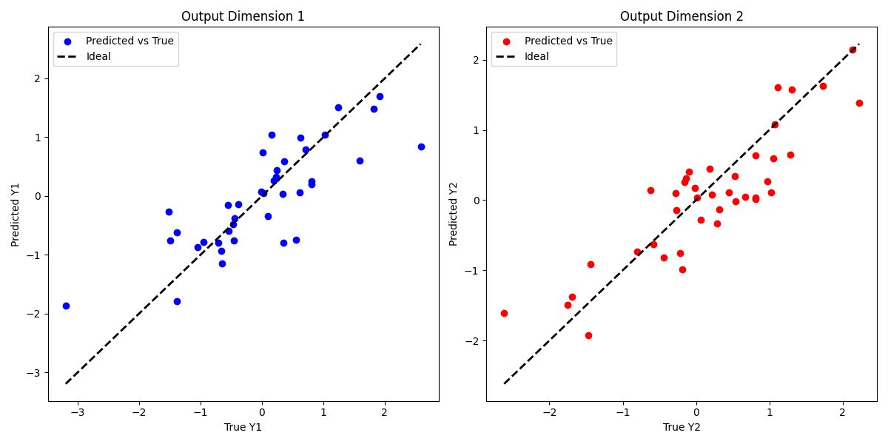
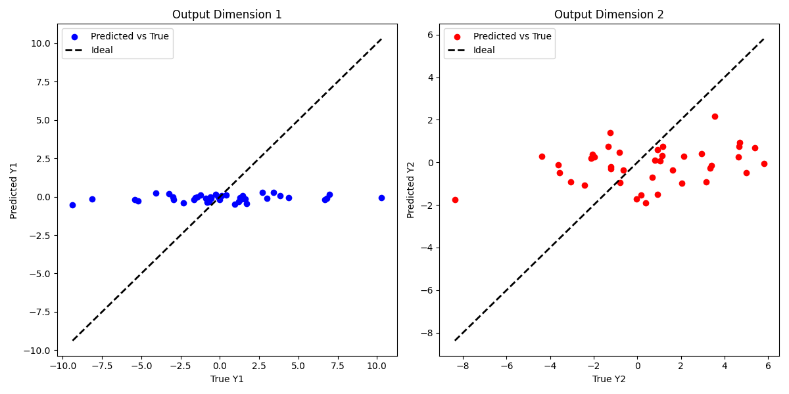

# Baselines based on existing works with similar targets

By sifting the existing works targeting golf playing, they share similarities in the need to estimate the hitting parameters for executing the hitting action. GMR and GPR are adopted to estimate the hitting parameters for new holes based on existing holes, another example utilizes a neural network to learn the model's physics feature. It is visible that both the works focus on the estimation of the hitting parameters based on positions. We chose their best performing method GPR as the baseline for our work.

We adopted the GPR algorithm from the scikit-learn to study on our dataset. The results as followss: for the simple court that is similar to the task mentioned in the paper with the GPR method, the mean squared error of the parameter is 0.32, and the hitting accuracy is 0.78; meanwhile, for the complexed court, the mean squared error of the parameter is 11.60, the hitting accuracy is almost 0.0. The results images as follow: , 

