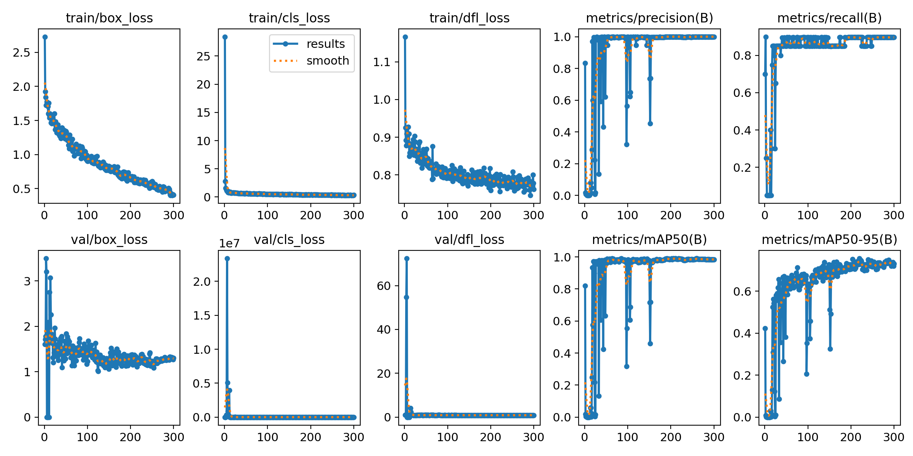
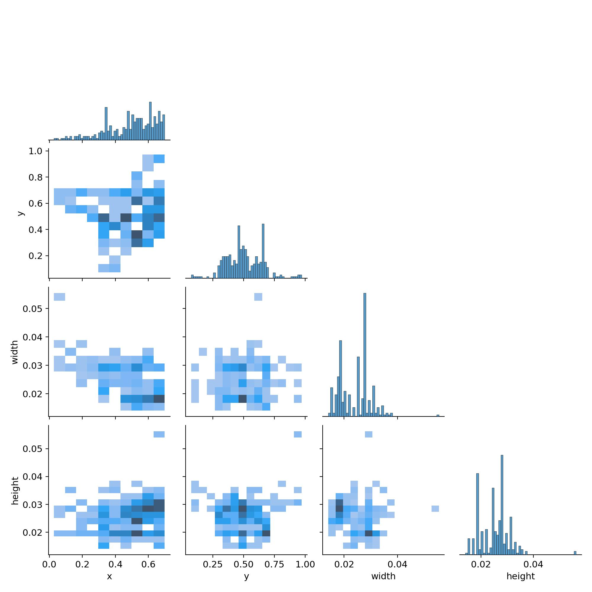
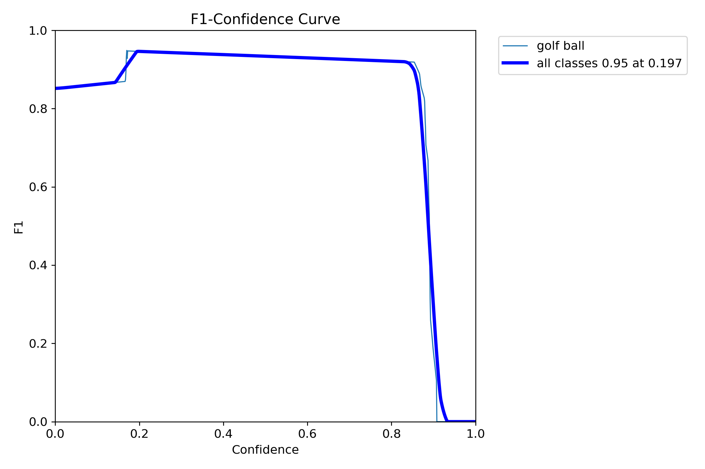

# Evaluation for the hitting outcomes

We adopt the Hausdorff distance to evaluate the hitting outcomes. 

The Hausdorff distance is a measure of how similar two sets of points are, and it is defined as the maximum distance between a point in one set and the closest point in the other set. In the context of evaluating the hitting outcomes, we use the Hausdorff distance to measure the similarity between the predicted hitting outcomes and the ground truth hitting outcomes.

The Hausdorff distance of average for each level is calculated as follows:
| Level | Hausdorff Distance |
| --- | --- |
| Easy | 43.18 |
| Medium | 67.08 |
| Hard | 108.39 |

It is noticable that in the hard level court there is an immense lift in the distance, the reason to this incidence is the introduction of more obstacles and the complexity of the court.

# Dynamic tracking quantitative evaluation

The dynamic tracking module presents with following results, including the loss and accuracy of the model, more details can be found in the following sections:

Full results image demonstrates the loss across the training and validation sets, as well as the accuracy of the model. The loss is calculated using the mean squared error, and the accuracy is calculated as the percentage of correct predictions. The image also depicts the mAP50, which is the mean average precision at 50% intersection over union (IoU) threshold. The mAP50 is a common metric used to evaluate object detection models, and it provides a measure of how well the model localizes objects in an image.

The following image demonstrates the label matching heatmap, which shows the correlation between the predicted labels and the ground truth labels. The heatmap provides a visual representation of how well the model predicts each label, with brighter colors indicating a higher correlation between the predicted and ground truth labels.

The following curve demonstrates the variation of the F1 score along the training procedure. The F1 score is a metric that combines precision and recall, providing a balanced measure of the model's performance. The curve shows how the F1 score changes as the model is trained, with higher values indicating better performance.

# Performance

| Scenario                                | Success Ratio | Trials to First Success |
|-----------------------------------------|---------------|-------------------------|
| **Performance in Simple Courts**        |               |                         |
| Nautilus Target                         | 6/10 (60%)    | 5                       |
| Yellow Disk Target                      | 10/10 (100%)  | 1                       |
| Volcano Target                          | 8/10 (80%)    | 3                       |
| **Performance in Medium Courts**        |               |                         |
| Variations of Endpoint Positions        | 8/10 (80%)    | 3                       |
| Variations of Endpoint Types            | 7/10 (70%)    | 3                       |
| Courts with Multiple Feasible Solutions | 7/10 (70%)    | 4                       |
| Complex Kinodynamic                     | 8/10 (80%)    | 3                       |
| **Performance in Complex Minigolf Course Layouts** |               |                         |
| Example 1                               | 7/10 (70%)    | 4                       |
| Example 2                               | 8/10 (80%)    | 3                       |
| Example 3                               | 8/10 (80%)    | 3                       |
| Example 4                               | 7/10 (70%)    | 4                       |
| Example 5                               | 7/10 (70%)    | 4                       |
| Example 6                               | 8/10 (80%)    | 3                       |
